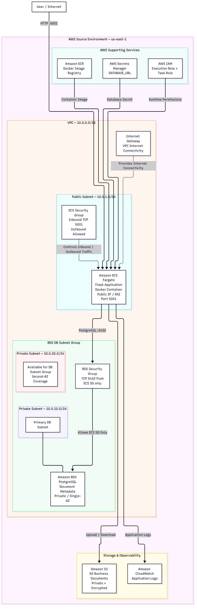
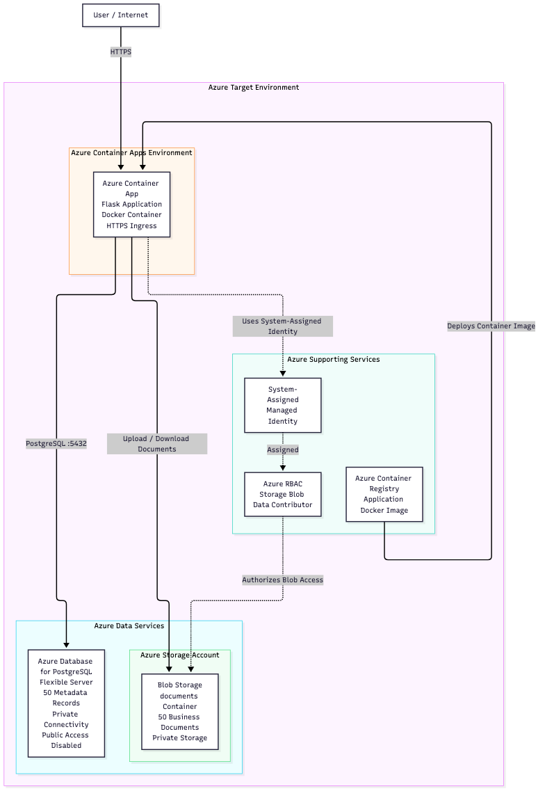
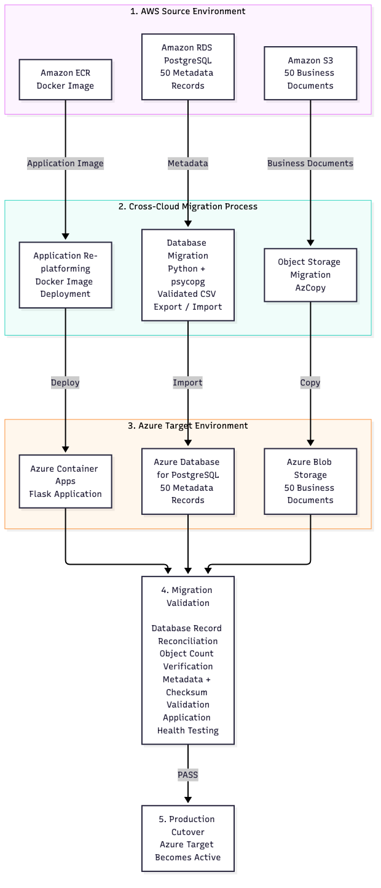

# AWS to Azure Document Management Migration

## Project Overview

This project demonstrates an end-to-end cross-cloud migration of a containerized document management application from Amazon Web Services (AWS) to Microsoft Azure.

The source workload was deployed on AWS using Amazon ECS with Fargate, Amazon ECR, Amazon RDS for PostgreSQL, Amazon S3, IAM, Secrets Manager, and CloudWatch. The target environment was provisioned in Azure using Azure Container Apps, Azure Container Registry, Azure Database for PostgreSQL Flexible Server, Azure Blob Storage, Managed Identity, and Azure RBAC.

The migration covered three primary workload components:

- **Application:** Re-platformed a Dockerized Python Flask application from Amazon ECS/Fargate to Azure Container Apps.
- **Database:** Migrated 50 PostgreSQL document metadata records from Amazon RDS to Azure Database for PostgreSQL.
- **Object Storage:** Migrated 50 business documents from Amazon S3 to Azure Blob Storage.

Infrastructure was provisioned with Terraform, and migration validation included record counts, object counts, metadata comparison, file-size verification, SHA-256 checksum validation, application health testing, and controlled cutover and rollback procedures.

---

## Architecture

### AWS Source Architecture

The AWS source environment hosted the containerized Flask application on Amazon ECS with AWS Fargate. Amazon RDS for PostgreSQL stored document metadata, Amazon S3 stored business documents, Amazon ECR stored the application image, AWS Secrets Manager protected the database connection secret, IAM controlled workload permissions, and CloudWatch provided application logging.

### Azure Target Architecture

The Azure target environment re-platformed the workload onto managed Azure services. Azure Container Apps hosted the application, Azure Database for PostgreSQL Flexible Server stored migrated metadata, Azure Blob Storage stored business documents, and Azure Container Registry stored the application image.

A system-assigned Managed Identity and Azure RBAC provided credential-free access from the application to Blob Storage.

### Cross-Cloud Migration Flow

The migration transferred three workload components from AWS to Azure:

1. Docker application workload from Amazon ECS/Fargate to Azure Container Apps.
2. PostgreSQL metadata from Amazon RDS to Azure Database for PostgreSQL.
3. Business documents from Amazon S3 to Azure Blob Storage.

---

## Migration Dataset

A controlled synthetic dataset was created to provide a known baseline for migration testing.

| Dataset | AWS Source | Azure Target | Result |
|---|---:|---:|---|
| PostgreSQL metadata records | 50 | 50 | PASS |
| Business documents | 50 | 50 | PASS |

The 50 business documents represented multiple departments and file formats, including TXT, CSV, DOCX, XLSX, PDF, and PNG. Each document had a corresponding PostgreSQL metadata record containing information such as its filename, department, uploader, storage location, file size, and checksum.

---

## Migration Implementation

### Application Migration

The Python Flask application was packaged as a Docker container. The AWS source image was stored in Amazon ECR and executed on Amazon ECS with AWS Fargate.

For the Azure target environment, the application was re-platformed to Azure Container Apps using an image stored in Azure Container Registry.

The application's storage abstraction allowed the backend to transition from Amazon S3 to Azure Blob Storage without redesigning the core application.

### PostgreSQL Metadata Migration

The source Amazon RDS PostgreSQL database contained 50 controlled document metadata records.

Because the source RDS database was private and the ECS application image did not contain the `pg_dump` utility, the migration used a controlled Python/psycopg export-import workflow.

The source records were exported to a validated CSV migration artifact, transferred to the Azure environment, and imported into Azure Database for PostgreSQL Flexible Server.

Post-migration checks verified:

- Record counts
- Primary keys
- Selected metadata
- Object/storage keys
- Stored SHA-256 checksum values
- Department distribution

All 50 source records were successfully reconciled with the Azure target.

### Object Storage Migration

The 50 business documents stored in Amazon S3 were migrated to the Azure Blob Storage `documents` container using AzCopy.

The migration was executed from a controlled migration workstation using temporary AWS credentials and Azure authentication. Temporary AWS credentials were removed from the migration shell after the transfer.

Post-migration validation compared:

- Object counts
- Object names and storage keys
- File sizes
- SHA-256 checksums

All 50 expected business documents were successfully validated in Azure Blob Storage.

---

## Migration Validation

Validation was performed before cutover to confirm that the Azure target preserved the AWS source data and application functionality.

| Validation Check | Result |
|---|---|
| PostgreSQL records: 50 AWS → 50 Azure | PASS |
| Primary keys and selected metadata | PASS |
| Object/storage keys | PASS |
| Department distribution | PASS |
| Business documents: 50 AWS → 50 Azure | PASS |
| File sizes | PASS |
| SHA-256 checksums | PASS |
| Azure application health | PASS |
| Document upload/download functionality | PASS |

SHA-256 checksums provided file-level integrity verification, while database and storage comparisons confirmed that structured metadata and business documents remained consistent throughout the migration.

---

## Security Architecture

Security controls were implemented independently for the AWS source and Azure target environments using cloud-native identity, secret-management, storage, and network controls.

### AWS

- Amazon RDS PostgreSQL was deployed without public database access.
- The RDS security group permitted PostgreSQL traffic on port 5432 only from the ECS security group.
- Amazon S3 was configured as private storage with public access blocked and server-side encryption enabled.
- AWS Secrets Manager stored the PostgreSQL database connection secret.
- Separate ECS execution and task roles were used for deployment and runtime permissions.
- IAM permissions controlled access to AWS resources without embedding AWS credentials in the application.

### Azure

- Azure Database for PostgreSQL Flexible Server was deployed with public access disabled.
- Azure Blob Storage was configured as private storage.
- Azure Container Apps used a system-assigned Managed Identity.
- Azure RBAC granted the workload the Storage Blob Data Contributor role.
- The application accessed Blob Storage without storing an account key or connection string in application code.

This design demonstrates a transition from AWS IAM-based workload authorization to Azure Managed Identity and RBAC while maintaining least-privilege access patterns.

---

## Infrastructure as Code

Terraform was used to define cloud infrastructure across both AWS and Azure.

The AWS environment included infrastructure definitions for services such as:

- Amazon ECS/Fargate
- Amazon ECR
- Amazon RDS for PostgreSQL
- Amazon S3
- IAM and security controls
- VPC networking

The Azure environment included infrastructure definitions for:

- Azure Container Apps
- Azure Container Registry
- Azure Database for PostgreSQL Flexible Server
- Azure Blob Storage
- Managed Identity and RBAC
- Azure networking and resource configuration

Using Infrastructure as Code made the environments reproducible and documented the source and target architectures alongside the application and migration workflow.

---

## Cutover and Rollback

After migration validation passed, the Azure environment was treated as the active target environment.

Cutover testing verified that:

- The Flask application was running successfully in Azure Container Apps.
- The application connected to Azure Database for PostgreSQL.
- Document upload and download operations used Azure Blob Storage.
- Migrated metadata and documents were accessible through the Azure workload.
- Application health checks passed after migration.

A documented rollback path retained the AWS ECS/Fargate source environment so the source workload could be used again if migration validation or post-cutover testing failed.

This allowed the target environment to be validated before being accepted as the migration destination.

---

## Architecture and Cost Decisions

This project was designed as a portfolio migration environment rather than a production-scale enterprise platform. Architecture decisions were intentionally made to balance migration realism, security, and cloud cost.

- Amazon ECS with AWS Fargate was used instead of EC2 to demonstrate managed container orchestration.
- Azure Container Apps was selected to demonstrate application re-platforming rather than a direct virtual-machine migration.
- Amazon RDS remained private and accepted PostgreSQL traffic only from the ECS workload.
- Azure Database for PostgreSQL was configured with public access disabled.
- A NAT Gateway and Application Load Balancer were not added to the AWS lab environment to avoid unnecessary recurring costs.
- Managed Identity and Azure RBAC were used instead of application-managed Blob Storage credentials.
- The migration dataset was intentionally controlled at 50 metadata records and 50 business documents so record counts, object counts, file sizes, metadata, and checksums could be precisely reconciled.

A production implementation could extend the architecture with additional high availability, private networking, centralized monitoring, load balancing, disaster recovery, and centralized secret-management controls.

---

## Project Results

The AWS-to-Azure migration was completed while preserving application functionality and data integrity.

Key outcomes:

- Re-platformed a containerized Flask application from Amazon ECS/Fargate to Azure Container Apps.
- Migrated 50 PostgreSQL metadata records from Amazon RDS to Azure Database for PostgreSQL.
- Migrated 50 business documents from Amazon S3 to Azure Blob Storage using AzCopy.
- Verified database records, metadata, object keys, file sizes, and SHA-256 checksums.
- Validated application health and document upload/download functionality in Azure.
- Implemented cloud infrastructure using Terraform across AWS and Azure.
- Applied AWS IAM, Secrets Manager, Azure Managed Identity, RBAC, private storage, and restricted database connectivity.
- Documented and tested a controlled migration cutover and rollback strategy.

---

## Technologies Used

**Cloud Platforms:** AWS, Microsoft Azure  
**Infrastructure as Code:** Terraform  
**Application:** Python, Flask  
**Containers:** Docker  
**AWS:** ECS, Fargate, ECR, RDS for PostgreSQL, S3, IAM, Secrets Manager, CloudWatch  
**Azure:** Container Apps, Container Registry, Database for PostgreSQL Flexible Server, Blob Storage, Managed Identity, RBAC  
**Migration:** AzCopy, Python, psycopg  
**Database:** PostgreSQL  
**Validation:** SHA-256 checksums, record reconciliation, object validation, application health testing
